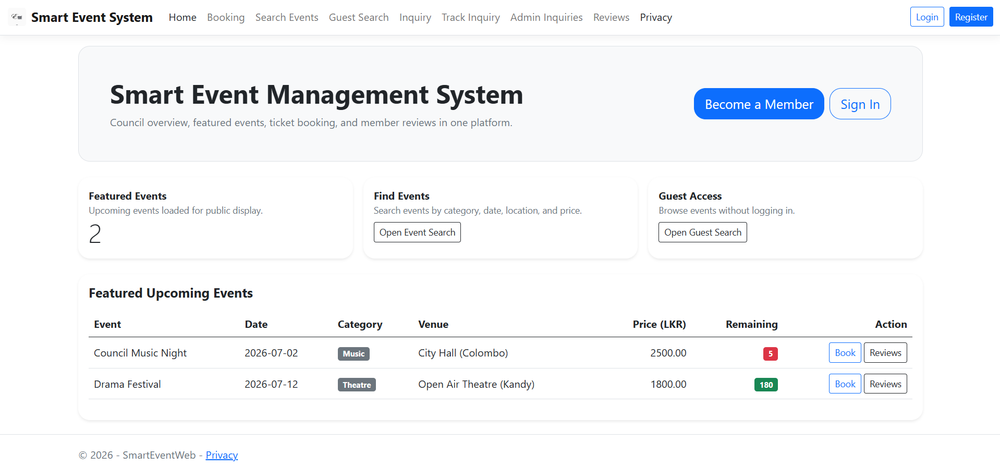

# 🎉 Smart Event Management System



## 📌 Project Overview

The **Smart Event Management System** is a web-based application developed using **ASP.NET Core MVC** that simplifies event planning, management, and participation. The system provides a centralized platform where users can browse events, register for activities, and manage event-related information efficiently.

The application follows the **Model-View-Controller (MVC)** architecture and includes authentication, database management, and responsive web interfaces to deliver a seamless user experience.

---

## 🎯 Project Objectives

The main objectives of this system are:

* Simplify event organization and management processes.
* Provide users with an easy-to-use event registration platform.
* Enable secure user authentication and authorization.
* Improve communication between event organizers and participants.
* Maintain event information through a centralized database.

---

## ✨ Key Features

### 👤 User Authentication

* User registration and login
* Identity-based authentication and authorization
* Secure account management

### 📅 Event Management

* Create and manage events
* View upcoming events
* Update event details
* Organize event schedules

### 🎟️ Event Registration

* Register for events
* Manage participant information
* Track event attendance

### 🌐 Responsive Web Interface

* User-friendly navigation
* Modern ASP.NET MVC views
* Interactive web pages

---

## 🏗️ System Architecture

```text
Users

   ↓

ASP.NET Core MVC Application

   ↓

Controllers

   ↓

Services

   ↓

Models

   ↓

Entity Framework Core

   ↓

Database
```

---

## 📷 Application Screenshot

### 🏠 Home Page

Add your homepage screenshot in:

```text
assets/
└── home_page.png
```

The image will automatically appear at the top of this README.

---

## 📂 Project Structure

```text
SmartEventWeb
│
├── Areas/
│   └── Identity/
│
├── Controllers/
│
├── Migrations/
│
├── Models/
│
├── Services/
│
├── Views/
│
├── wwwroot/
│
├── Properties/
│
├── Program.cs
├── appsettings.Development.json
├── SmartEventWeb.csproj
├── SmartEventWeb.sln
└── README.md
```

---

## 🛠️ Technologies Used

### Backend

* ASP.NET Core MVC
* C#
* Entity Framework Core

### Frontend

* HTML5
* CSS3
* Bootstrap
* JavaScript

### Authentication

* ASP.NET Core Identity

### Development Tools

* Visual Studio
* SQL Server

---

## ⚙️ Installation

Clone the repository:

```bash
git clone https://github.com/yourusername/SmartEventWeb.git
```

Navigate to the project folder:

```bash
cd SmartEventWeb
```

Restore dependencies:

```bash
dotnet restore
```

Update the database:

```bash
dotnet ef database update
```

Run the application:

```bash
dotnet run
```

---

## 🚀 Future Enhancements

Potential future improvements include:

* Online payment integration
* Email notifications for participants
* Event analytics dashboard
* QR code-based event check-in
* Mobile application support
* Real-time event updates

---

## 👩‍💻 Author

Software Developer | ASP.NET Core Developer Built ❤️ by <a href="https://github.com/IleeshaUdari"><strong>M.G.Ileesha Udari Sasmitha</strong></a>

---

## ⭐ Support

If you found this project useful, consider giving it a ⭐ on GitHub.
